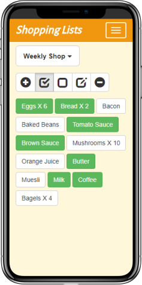
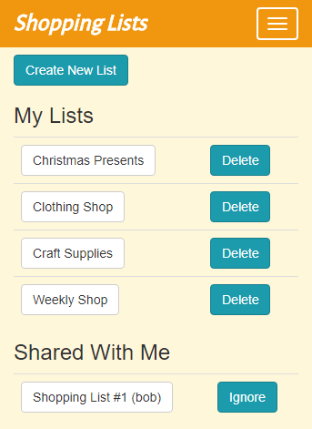
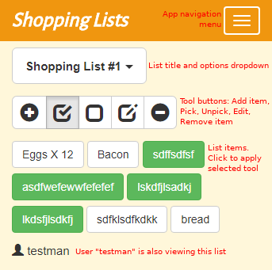
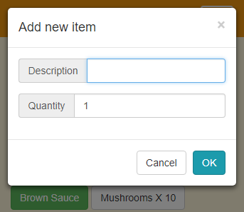
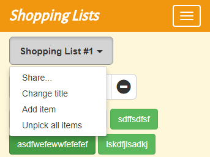
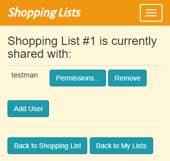
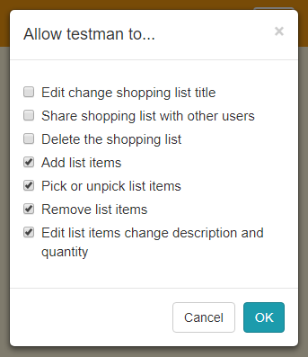

Shopping Lists
==============

Create online shopping lists that can be shared by multiple users. Users can work together to collect items from a single list. The application shows which items have been picked and which items are still outstanding. Updates to list item picked/unpicked status are pushed from the server to the browser to provide live updates to each connected client.

Features
--------
Real-time updates when a user picks, unpicks, adds or removes items.

Permissions management: User can state which actions other users can perform on the shared shopping list.

Shows which other users that are viewing the shared shopping list.

The User Interface
------------------
#### My Lists
Shows all shopping lists created by and shared with the current user.

#### Individual Shopping List
The main shopping list view.

#### Add/edit an item
Allows items to be edited or existing items to be added to the shopping list. The quantity of each item may also be set.

#### Shopping list actions
A dropdown menu providing several actions which may be performed on the current shopping list.

#### Share the list
Allows the current shopping list to be shared with other users.

#### Sharing permissions
After the shopping list has been shared with another user, this view allows the list creator to specify what the other user is allowed to do with the list.

Requirements
------------
__Client:__

* HTML5 capable browser (WebSockets support recommended).

__Server:__

* .NET Framework 4.5.2
* IIS or IIS Express (WebSockets support recommended).
* SQL Server 2012+ Express LocalDB.

Starting the Application
------------------------
* Build the solution to add NuGet packages.
* For best performance, run the project without debugging and using the Release configuration.
* Display the main page by going to the following URL in a browser:

	[http://localhost:49171/](http://localhost:49171/)

* Register an account then create a shopping list!
	
Technologies Used
-----------------
ASP.NET MVC 5

Web API 2

SignalR

Entity Framework

SQL Server Data Tools (Used in preference to EF Code First Migrations)

Bootstrap

Knockout.js

LightInject

Visual Studio Testing Tools

Moq

Effort (Used in integration tests)

Architectural Features
----------------------
Layered design separating the concerns of data access, business rules and UI presentation:

* Data Access Layer - Provides Repository classes for the Business layer to use. Repositories serve as an abstraction over EntityFramework and IQueryable LINQ. Only IEnumerable gets exposed to the Business Layer.

* Business Layer - Business logic in service classes which are used by the Web API and UI. Not concerned with how the data gets persisted. 

* Web UI and API - Only concerned with web presentational logic. Converts entities to view models.

Custom attributes for validating anti-forgery token in AJAX post requests.

MVVM: JSON view models. Knockout.js. AJAX and SignalR.

Custom user account persistence (wired up own UserService class to Identity to make it work with the layered architecture).

Dependency Injection used throughout.

Client:

* Bootstrap modal popup forms.

* Responsive display adjusts to small screens.

* Knockout form validation.